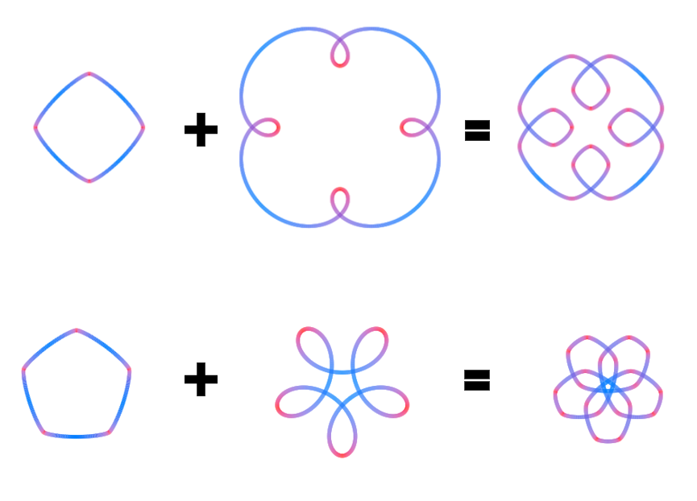

<div align="center">

# Vector Space of Curves

#### [→ Try it out.](https://davidunga.github.io/vector-space-of-curves/)



Built on a parameterization by Huh & Sejnowski, where summing two curves yields an intuitive blend that preserves the geometric features of both.

</div>

### Parameterization

A curve is defined by its radius of curvature `r` as a function of the tangent angle `θ`:

```
log r(θ) = ε · sin((m/n)·θ − φ)
```

- `m, n` — co-prime integers; `m` is the rotational symmetry of the shape, `n` its period in `θ`
- `ε` — eccentricity (amplitude of the log-radius oscillation)
- `φ` — phase offset

### References

- Huh, D. (2015). *The vector space of convex curves: How to mix shapes.* arXiv:1506.07515.
- Huh, D., & Sejnowski, T. J. (2015). *Spectrum of power laws for curved hand movements.* PNAS, 112(29), E3950–E3958.
